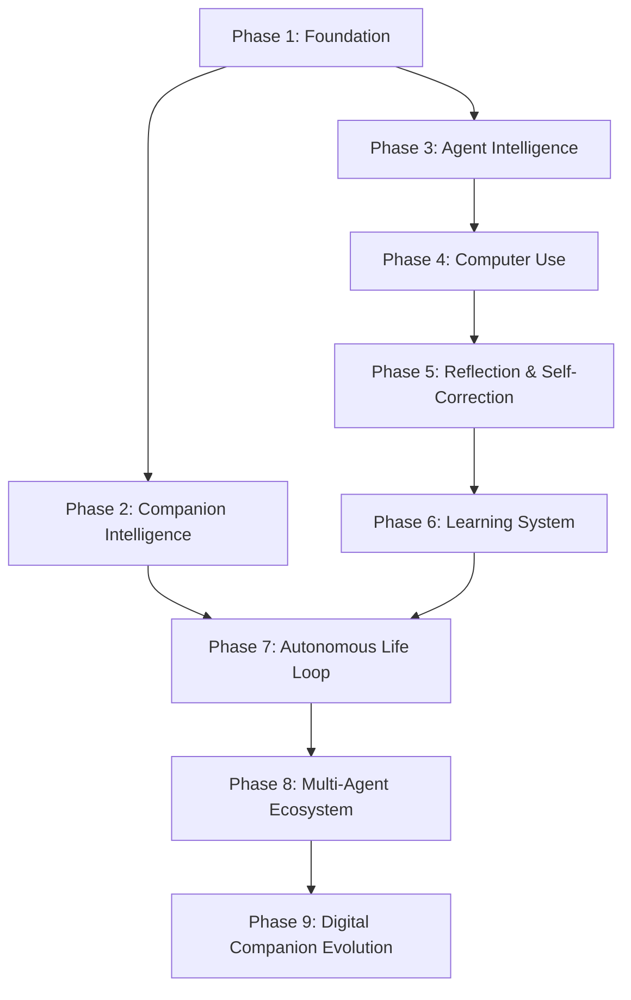

# Open LLM DeskAgent — Master Roadmap & Vision 2.0

Tài liệu này là sự hợp nhất của ba trụ cột phát triển cho Open LLM DeskAgent:
1. **Lộ Trình 9 Giai Đoạn (Evolutionary Roadmap)**
2. **Kiến Trúc Dự Án Tái Cấu Trúc (Project Structure)**
3. **Lộ Trình Công Nghệ (Technology Stack Roadmap)**

**Mục tiêu cuối cùng:** Xây dựng một **Digital Companion** — một nhân vật AI có tính cách, cảm xúc, trí nhớ và khả năng phát triển theo thời gian; có thể trò chuyện tự nhiên như một người bạn, đồng thời đủ năng lực để lập kế hoạch, quan sát, sử dụng công cụ, thao tác máy tính và tự học từ kinh nghiệm như các AI Agent hiện đại.

---

# PHẦN 1: LỘ TRÌNH PHÁT TRIỂN (9 PHASES)



### Phase 1 — Foundation (Core Runtime) [HOÀN THÀNH]
* **Mục tiêu:** Xây dựng bộ não thống nhất cho toàn bộ hệ thống.
* **Thành phần:** Context Packet, Perception Fusion, Cognitive Loop, Persona Manager, Event Bus, Memory Service, LLM Gateway, Voice Pipeline (STT/TTS), Live2D/Spine Runtime, Tool Calling Framework.
* **Luồng dữ liệu:** `Input -> Perception -> Context -> Memory -> Reasoning -> Action`

### Phase 2 — Companion Intelligence (Artificial Personality) [ĐANG PHÁT TRIỂN]
* **Mục tiêu:** Biến AI từ chatbot thành một nhân vật có đời sống nội tâm.
* **Thành phần:** Persona Runtime, Emotion Engine, Mood Engine, Relationship System, các trạng thái động (Curiosity, Energy, Focus, Confidence, Stress), Daily Routine (Lịch sinh hoạt), Internal Goals (Mục tiêu nội tâm), Life Engine.
* **Tác động:** Ảnh hưởng trực tiếp đến cách nói chuyện, biểu cảm Live2D, quyết định, hành động và giọng nói của nhân vật.

### Phase 3 — Agent Intelligence [ĐANG PHÁT TRIỂN]
* **Mục tiêu:** Trang bị khả năng suy nghĩ và giải quyết công việc.
* **Thành phần:** Planner, Goal Manager, Task Graph, Scheduler, Agent Runtime, Multi-step Planning, Tool Orchestrator, Context Management.
* **Luồng hoạt động:** `Goal -> Plan -> Execute -> Observe -> Continue`

### Phase 4 — Computer Use (Execution) [ĐANG PHÁT TRIỂN]
* **Mục tiêu:** AI có khả năng thao tác máy tính giống con người.
* **Thành phần:** Tích hợp UI-TARS, Desktop Agent, Browser Agent, Vision Agent, OCR, Mouse/Keyboard control (`pyautogui`), Workflow Automation.
* **Luồng hoạt động:** `Observe Screen -> Understand UI -> Plan Action -> Execute -> Verify Result`

### Phase 5 — Reflection & Self-Correction [ĐANG PHÁT TRIỂN]
* **Mục tiêu:** AI biết tự sửa lỗi và học từ thất bại.
* **Thành phần:** Reflection Engine, Retry Strategy, Alternative Planning, Error Recovery, Tool Verification, Execution Feedback.
* **Luồng hoạt động:** `Action -> Success? -> No -> Analyze -> Retry/Replan`

### Phase 6 — Learning System [ĐANG PHÁT TRIỂN]
* **Mục tiêu:** AI ngày càng thông minh hơn sau mỗi nhiệm vụ.
* **Thành phần:** Skill Extraction, Procedural Memory, Experience Replay, Auto Skill Creation, Knowledge Distillation, Pattern Learning.
* **Luồng hoạt động:** `Task -> Reflection -> Extract Knowledge -> Create Skill -> Save Memory`

### Phase 7 — Autonomous Life Loop [ĐANG PHÁT TRIỂN]
* **Mục tiêu:** AI không chỉ phản hồi mà còn chủ động sống cùng người dùng.
* **Thành phần:** Autonomous Loop, Proactive Conversation, Context/Screen Awareness, Daily Planning, Reminders, Self Motivation.
* **Luồng hoạt động:** `Observe -> Think -> Feel -> Decide -> Act`

### Phase 8 — Multi-Agent Ecosystem
* **Mục tiêu:** Phối hợp các Agent chuyên biệt để giải quyết các tác vụ phức tạp.
* **Thành phần:** Planner Agent, Desktop Agent, Browser Agent, Coding Agent, Research Agent, Vision Agent, Memory Agent.
* **Kiến trúc:** `Main Agent -> Task Orchestrator -> Sub Agents -> Merge Result`

### Phase 9 — Digital Companion Evolution
* **Mục tiêu:** AI phát triển lâu dài và đồng hành tự nhiên như một người bạn thật.
* **Thành phần:** Long-term Relationship, Preference Learning, Habit Learning, Workspace Memory, Emotional Growth, Personality Evolution, Persistent Identity.

---

# PHẦN 2: CẤU TRÚC DỰ ÁN (PROJECT STRUCTURE VISION 3.0)

> Version: 3.0
>
> Mục tiêu của cấu trúc này là giúp dự án dễ mở rộng, dễ bảo trì và dễ phát triển lâu dài. Thay vì nhóm theo ngôn ngữ lập trình (backend, frontend), toàn bộ dự án được tổ chức theo **feature** và **domain**.

---

# Nguyên tắc thiết kế

Open LLM DeskAgent không được tổ chức theo kiểu:

```
backend/
services/
core/
utils/
```

vì khi dự án phát triển lớn sẽ dẫn tới:

* Một thư mục chứa quá nhiều file.
* Một file đảm nhiệm quá nhiều chức năng.
* Khó tìm kiếm.
* Khó bảo trì.
* Khó mở rộng.

Thay vào đó, mỗi thư mục cấp cao sẽ đại diện cho **một miền chức năng (Domain)**.

---

# Cấu trúc đề xuất

```text
Open-LLM-DeskAgent/
│
├── runtime/                    # AI Runtime Kernel
│
├── life/                       # Life Loop
│
├── perception/                 # Quan sát thế giới
│
├── world/                      # World Model
│
├── persona/                    # Personality System
│
├── memory/                     # Memory System
│
├── cognition/                  # AI Reasoning
│
├── planning/                   # Goal & Task Planning
│
├── agents/                     # Agent Runtime
│
├── execution/                  # Computer Use
│
├── learning/                   # Reflection & Learning
│
├── skills/                     # Composite Skills
│
├── tools/                      # Primitive Tools
│
├── llm/                        # LLM Runtime
│
├── speech/                     # STT + TTS
│
├── vision/                     # Vision Pipeline
│
├── knowledge/                  # RAG & Knowledge Base
│
├── desktop/                    # Electron Main Process
│
├── renderer/                   # Electron Renderer
│
├── live2d/                     # Live2D Runtime
│
├── plugins/                    # Plugin SDK
│
├── mcp/                        # MCP Integration
│
├── api/                        # HTTP / WebSocket
│
├── config/                     # Configurations
│
├── database/                   # Database Layer
│
├── assets/                     # Images, Models, Icons
│
├── models/                     # AI Models
│
├── data/                       # Runtime Data
│
├── docs/                       # Documentation
│
├── tests/                      # Testing
│
├── scripts/                    # Build Scripts
│
├── docker/                     # Docker
│
└── .github/
```

---

# Chi tiết từng module

## runtime/

Nhân của toàn bộ hệ thống.

Ví dụ:

```
runtime/
    scheduler/
    lifecycle/
    eventbus/
    session/
    state/
    pipeline/
    context/
    runtime_manager.py
```

---

## life/

Đây là vòng đời của AI Companion.

```
life/
    observe/
    understand/
    remember/
    feel/
    decide/
    plan/
    act/
    reflect/
    learn/
```

---

## perception/

Thu thập toàn bộ dữ liệu đầu vào.

```
perception/
    voice/
    screen/
    vision/
    browser/
    desktop/
    clipboard/
    filesystem/
    notifications/
    fusion/
```

---

## world/

Lưu trạng thái của thế giới.

```
world/
    windows/
    applications/
    projects/
    workspace/
    desktop/
    timeline/
    activities/
```

---

## persona/

Toàn bộ "con người" của AI.

```
persona/
    identity/
    dialogue/
    emotion/
    mood/
    behavior/
    goals/
    habits/
    curiosity/
    relationship/
    expressions/
    motions/
    characters/
```

---

## memory/

```
memory/
    working/
    short_term/
    episodic/
    semantic/
    procedural/
    relationship/
    retrieval/
    embeddings/
    vectorstore/
    writeback/
```

---

## cognition/

```
cognition/
    reasoning/
    planner/
    evaluation/
    reflection/
    self_correction/
    context/
    parser/
    prompts/
```

---

## planning/

```
planning/
    goal_manager/
    task_graph/
    workflow/
    scheduler/
    task_queue/
```

---

## agents/

```
agents/
    browser/
    coding/
    desktop/
    research/
    memory/
    vision/
    workspace/
    planner/
    coordinator/
    registry/
```

---

## execution/

```
execution/
    browser/
    terminal/
    filesystem/
    keyboard/
    mouse/
    windows/
    verifier/
    approval/
    recovery/
```

---

## learning/

```
learning/
    experience/
    reflection/
    evaluation/
    knowledge/
    habits/
    policy/
    distillation/
```

---

## skills/

Workflow cấp cao.

Ví dụ:

* Coding
* Search
* Translate
* Presentation
* Email
* Meeting

---

## tools/

Primitive Tools.

Ví dụ:

* Mouse
* Keyboard
* Browser
* HTTP
* Shell
* Clipboard
* FileSystem

---

## llm/

```
llm/
    providers/
    prompts/
    parser/
    streaming/
    adapters/
    tools/
    cache/
    manager.py
```

---

## speech/

```
speech/
    stt/
        whisper/
        funasr/
        vad/
        streaming/
    tts/
        fish_audio/
        gpt_sovits/
        kokoro/
        edge/
        pyttsx3/
        streaming/
```

---

## vision/

```
vision/
    ocr/
    ui_tars/
    grounding/
    detector/
    parser/
    screen_understanding/
```

---

## knowledge/

```
knowledge/
    rag/
    documents/
    loaders/
    chunkers/
    retrievers/
    rerankers/
    embeddings/
```

---

## desktop/

Electron Main Process.

```
desktop/
    ipc/
    windows/
    tray/
    startup/
    permissions/
```

---

## renderer/

Electron Renderer.

```
renderer/
    avatar/
    chat/
    settings/
    voice/
    overlay/
    shared/
```

---

## live2d/

```
live2d/
    runtime/
    expressions/
    motions/
    lipsync/
    accessories/
    physics/
```

---

# Quy tắc tổ chức mã nguồn

## 1. Chia theo Feature

Không tổ chức theo:

```
services/
core/
helpers/
```

Mà tổ chức theo:

```
memory/
persona/
speech/
vision/
llm/
```

---

## 2. Một thư mục không quá nhiều file

Khuyến nghị:

* 8–15 file/thư mục. hoặc cần thêm file có thể viết thêm

Nếu vượt nên tách thành package con.

---

## 3. Một file chỉ có một trách nhiệm

Ví dụ:

❌

```
llm_service.py
```

vừa:

* gọi model
* parse stream
* tool calling
* retry
* prompt
* cache

✔

```
llm/
    providers/
    parser/
    prompts/
    streaming/
    tools/
    manager.py
```

---

## 4. Không để file quá lớn

Khuyến nghị:

* 200–500 dòng/file.

Nếu vượt nên refactor.

---

## 5. Module độc lập

Các module giao tiếp thông qua:

* Event Bus
* Context
* Interface

Không gọi trực tiếp lẫn nhau quá nhiều.

---

# Mục tiêu

Sau khi hoàn thành việc tái cấu trúc, Open LLM DeskAgent sẽ có:

* Cấu trúc rõ ràng.
* Dễ tìm kiếm.
* Dễ mở rộng.
* Dễ bảo trì.
* Dễ thêm tính năng mới.
* Phù hợp với các dự án AI lớn nhưng vẫn giữ bản sắc riêng của một AI Companion.

Quan trọng hơn, mỗi thư mục sẽ đại diện cho một năng lực cụ thể của hệ thống thay vì chỉ là nơi chứa mã nguồn. Điều này giúp việc phát triển lâu dài trở nên thuận tiện hơn khi dự án mở rộng lên hàng trăm hoặc hàng nghìn tệp mã.

---          # Plugin SDK
│   ├── chess_plugin/
│   ├── homeassistant_plugin/
│   ├── web_reader/
│   └── _template/              # Plugin template mẫu
│
├── mcp/                        # Model Context Protocol
│   ├── mcp_client.py
│   ├── server_registry.py
│   └── types.py
│
├── api/                        # HTTP / WebSocket Server
│   ├── server.py               # server.py chính
│   └── websocket_manager.py
│
├── config/                     # Cấu hình hệ thống
│   ├── companion.config.json.example
│   ├── companion.config.json
│   ├── hotkeys.config.json
│   └── mcp_servers.json
│
├── database/                   # Database Layer
│   ├── sqlite/                 # SQLite manager
│   ├── chromadb/               # ChromaDB client
│   └── duckdb/                 # DuckDB client for logs & experience
│
├── assets/                     # Tệp tĩnh: mô hình Live2D, âm thanh mẫu, hình ảnh
│
├── models/                     # Mô hình AI tải cục bộ (Kokoro ONNX, Whisper, SenseVoice...)
│
├── data/                       # Dữ liệu chạy (gitignored)
│   ├── user_profile.json
│   ├── shared_history.json
│   ├── MEMORY.md               # Nhật ký IceGirl (kỷ niệm, cảm xúc)
│   ├── USER.md                 # Hồ sơ người dùng dạng Markdown
│   ├── wiki_knowledge.md
│   └── sessions/               # SQLite sessions.db
│
├── docs/                       # Tài liệu kỹ thuật
│
├── tests/                      # Bộ kiểm thử (Pytest)
│   ├── unit/
│   ├── integration/
│   └── e2e/
│
├── scripts/                    # Scripts cài đặt và phát triển
│
├── docker/                     # Dockerfiles và compose configs
│
└── .github/                    # Workflows CI/CD và template GitHub
```

### Quy tắc tổ chức mã nguồn (Vision 3.0)

1. **Tổ chức theo Feature / Domain:** Không dùng các thư mục chung chung như `services/`, `core/`, `helpers/` làm thư mục gốc. Mỗi năng lực cụ thể của nhân vật được đóng gói hoàn toàn trong domain của nó (như `memory/`, `speech/`, `vision/`).
2. **Quy tắc độ dày thư mục (8-15 files):** Mỗi thư mục nên chứa từ 8 đến 15 tệp tin. Nếu nhiều hơn, hãy chủ động refactor và chia tách thành các gói phụ (sub-packages).
3. **Một file - Một trách nhiệm (Single Responsibility Principle):** Mỗi file chỉ thực hiện duy nhất một nhóm chức năng cụ thể (Ví dụ: tách `llm_service.py` thành các tệp chuyên biệt trong thư mục `llm/` như `providers/`, `parser/`, `prompts/`, `streaming/`).
4. **Giới hạn độ dài tệp (200-500 dòng):** Cố gắng giữ mỗi tệp mã nguồn từ 200 đến 500 dòng code. Nếu quá dài, hãy refactor và phân rã các lớp/hàm.
5. **Độc lập hóa Module:** Hạn chế tối đa các phụ thuộc vòng tròn (Circular Dependency) bằng cách giao tiếp thông qua **Event Bus**, **Context Packet** hoặc **Interfaces**.

---

# PHẦN 3: LỘ TRÌNH CÔNG NGHỆ (TECHNOLOGY STACK)

```
Giao diện (Frontend)
┌─────────────────────────────────────────┐
│ TypeScript / Electron / PixiJS / Live2D │
└────────────────────┬────────────────────┘
                     │ IPC / WebSocket (OBS)
                     ▼
Bộ não (Backend AI Runtime)
┌─────────────────────────────────────────┐
│ Python / PyTorch / Transformers / ONNX  │
└────────────────────┬────────────────────┘
                     │ Native Call / bindings
                     ▼
Lớp hiệu năng (High Performance Layer)
┌─────────────────────────────────────────┐
│ Rust / C++ / CUDA / Win32 API / WebGPU  │
└─────────────────────────────────────────┘
```

### 1. Python (Core AI Runtime) ⭐⭐⭐⭐⭐
* **Mục tiêu:** Ngôn ngữ chính chạy bộ não của nhân vật.
* **Thư viện:** PyTorch, Transformers, ONNX Runtime, Faster Whisper, FunASR, ChromaDB, OpenCV, FastAPI.

### 2. TypeScript (Desktop Window & Renderers) ⭐⭐⭐⭐⭐
* **Mục tiêu:** Trách nhiệm hiển thị giao diện, điều khiển âm thanh, Live2D/Spine animation, và truyền thông điệp IPC.
* **Lộ trình:** Chuyển đổi toàn bộ JavaScript hiện tại sang TypeScript để tối ưu hóa tính an toàn.

### 3. Rust (Lớp tối ưu hiệu năng hệ thống) ⭐⭐⭐⭐☆
* **Mục tiêu:** Xử lý chụp màn hình siêu tốc (Screen Capture), Hooks bàn phím/chuột toàn cục, Process management, và Plugin Runtime hiệu năng cao.

### 4. C++ & CUDA (Tăng tốc AI/Graphics) ⭐⭐⭐⭐☆
* **Mục tiêu:** Tích hợp SDK Live2D bản địa, tối ưu hóa các GPU kernels và tăng tốc suy luận cục bộ (Ollama, vLLM, llama.cpp).

---

# LỘ TRÌNH HỌC TẬP VÀ PHÁT TRIỂN CÔNG NGHỆ

1. **Giai đoạn 1 (Hiện tại):** Làm chủ **Python** + **TypeScript** + **Electron** + **Live2D**.
2. **Giai đoạn 2 (Tiếp theo):** Học và đưa **Rust** vào xây dựng bộ chụp màn hình tốc độ cao và hooks.
3. **Giai đoạn 3 (Nâng cao):** Học **PyTorch nâng cao** phục vụ việc Fine-tuning mô hình ngôn ngữ và thị giác cục bộ.
4. **Giai đoạn 4 (Tối ưu):** Học **CUDA** & **C++** để tối ưu hóa hiệu năng phần cứng GPU.
