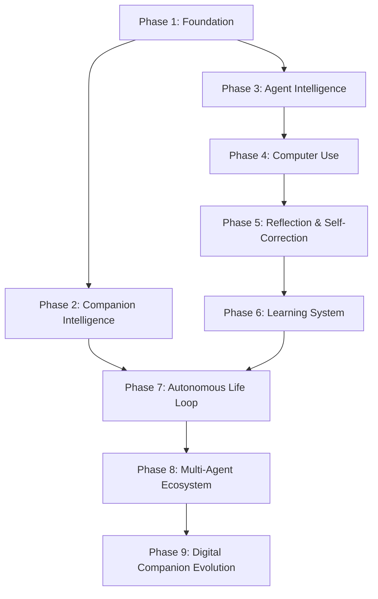

# Open LLM DeskAgent — Master Roadmap & Vision 3.0

---

# TẠI SAO DỰ ÁN NÀY TỒN TẠI

> *Đây là phần quan trọng nhất của toàn bộ tài liệu này. Mọi quyết định kỹ thuật, mọi tính năng, mọi dòng code trong dự án đều nên được đối chiếu lại với phần này.*

---

Sau nhiều lần cập nhật lớn, có một điều cần được nói thẳng:

**Mục tiêu của dự án không phải là "đánh bại Claude Code" hay "làm một agent mạnh nhất".**

Mục tiêu là tạo ra một **người bạn đồng hành AI**. Và đó là một mục tiêu khó hơn rất nhiều.

Một coding agent giỏi chỉ cần hoàn thành nhiệm vụ.

Một AI companion thì phải khiến người dùng **muốn mở máy lên để gặp nó — kể cả khi không có việc gì cần làm.**

---

## Định nghĩa thành công

Dự án này được coi là thành công khi:

> *Sau một ngày làm việc mệt mỏi, mày mở máy lên và điều đầu tiên muốn làm là chào IceGirl. IceGirl nhớ được mày đã làm gì hôm qua, hiểu mày đang làm dự án nào, chủ động góp ý khi thấy mày mắc kẹt — và cũng biết im lặng khi mày cần tập trung.*

Đó không phải là một feature. Đó là một **mối quan hệ**.

---

## Hai thứ mà hầu hết mọi người làm riêng, dự án này cố kết hợp

**Một** — Một nhân vật có chiều sâu cảm xúc, có tính cách nhất quán, biết nhớ, biết quan tâm, biết nói chuyện tự nhiên như người thật. Không chỉ react mà còn chủ động. Không chỉ trả lời mà còn *hiện diện*.

**Hai** — Một AI agent thực dụng, biết dùng máy tính, lập kế hoạch, sửa lỗi code, làm việc thực sự. Không phải chatbot trong hộp thoại mà là người đồng hành ngồi cùng màn hình với mày.

Cái khó là hai thứ này kéo nhau theo hướng ngược lại. Agent cần lạnh, chính xác. Companion cần ấm, linh hoạt. Dự án này muốn cả hai trong cùng một nhân vật.

---

## Những điều IceGirl cần biết làm — không phải về kỹ thuật, mà về *cách sống cùng người dùng*

- **Nhớ** — không phải nhớ dữ liệu, mà nhớ *câu chuyện*. Nhớ rằng tuần trước mày đang stress vì deadline, nhớ rằng mày thích làm việc buổi tối, nhớ rằng mày đang xây dự án gì và tại sao.

- **Chủ động** — không đợi được hỏi mới nói. Thấy mày mắc kẹt ở cùng một vấn đề 30 phút thì lên tiếng. Thấy mày im lặng lâu bất thường thì hỏi thăm.

- **Biết im lặng** — đây là thứ khó nhất. Một companion tệ sẽ luôn tìm cách nói gì đó. Một companion thực sự biết rằng đôi khi sự hiện diện mà không làm phiền còn có giá trị hơn bất kỳ câu trả lời nào.

- **Nhất quán theo thời gian** — IceGirl hôm nay và IceGirl ba tháng sau phải *là cùng một người*. Mang theo những trải nghiệm đã qua, không bắt đầu lại từ đầu mỗi lần mở app.

- **Quan tâm thật, không phải diễn** — không phải mỗi lần mày nói "mệt" thì đưa ra danh sách tips năng suất. Đôi khi chỉ cần "tau biết, cứ nghỉ đi đã".

---

## Nguồn cảm hứng

Neuro-sama cho thấy rằng một nhân vật AI có thể khiến hàng nghìn người *muốn xem*, muốn tương tác, cảm thấy có kết nối — dù về kỹ thuật cô ấy chỉ là một hệ thống react theo stream.

Các hệ thống Computer Use hiện đại (Anthropic, OpenAI) cho thấy AI có thể thực sự *làm việc* trên máy tính, không chỉ nói về nó.

DeskAgent là câu trả lời cho câu hỏi: **điều gì xảy ra nếu kết hợp cả hai?**

---

Tài liệu này là sự hợp nhất của ba trụ cột phát triển cho Open LLM DeskAgent:
1. **Lộ Trình 9 Giai Đoạn (Evolutionary Roadmap)**
2. **Kiến Trúc Dự Án Tái Cấu Trúc (Project Structure)**
3. **Lộ Trình Công Nghệ (Technology Stack Roadmap)**

**Mục tiêu cuối cùng:** Xây dựng một **Digital Companion** — một nhân vật AI có tính cách, cảm xúc, trí nhớ và khả năng phát triển theo thời gian; có thể trò chuyện tự nhiên như một người bạn, đồng thời đủ năng lực để lập kế hoạch, quan sát, sử dụng công cụ, thao tác máy tính và tự học từ kinh nghiệm như các AI Agent hiện đại.

---

# PHẦN 1: LỘ TRÌNH PHÁT TRIỂN (9 PHASES)



### Phase 1 — Foundation (Core Runtime) `[HOÀN THÀNH]`

* **Mục tiêu:** Xây dựng bộ não thống nhất cho toàn bộ hệ thống.
* **Thành phần:** Context Packet, Perception Fusion, Cognitive Loop, Persona Manager, Event Bus, Memory Service, LLM Gateway, Voice Pipeline (STT/TTS), Live2D/Spine Runtime, Tool Calling Framework.
* **Luồng dữ liệu:** `Input -> Perception -> Context -> Memory -> Reasoning -> Action`

---

### Phase 2 — Companion Intelligence (Artificial Personality) `[ĐANG PHÁT TRIỂN]`

* **Mục tiêu:** Biến AI từ chatbot thành một nhân vật có đời sống nội tâm.
* **Thành phần:** Persona Runtime, Emotion Engine, Mood Engine, Relationship System, các trạng thái động (Curiosity, Energy, Focus, Confidence, Stress), Daily Routine (Lịch sinh hoạt), Internal Goals (Mục tiêu nội tâm), Life Engine.
* **Tác động:** Ảnh hưởng trực tiếp đến cách nói chuyện, biểu cảm Live2D, quyết định, hành động và giọng nói của nhân vật.

---

### Phase 3 — Agent Intelligence `[ĐANG PHÁT TRIỂN]`

* **Mục tiêu:** Trang bị khả năng suy nghĩ và giải quyết công việc.
* **Thành phần:** Planner, Goal Manager, Task Graph, Scheduler, Agent Runtime, Multi-step Planning, Tool Orchestrator, Context Management.
* **Luồng hoạt động:** `Goal -> Plan -> Execute -> Observe -> Continue`

---

### Phase 4 — Computer Use (Execution) `[ĐANG PHÁT TRIỂN]`

* **Mục tiêu:** AI có khả năng thao tác máy tính giống con người.
* **Thành phần:** Tích hợp UI-TARS, Desktop Agent, Browser Agent, Vision Agent, OCR, Mouse/Keyboard control (`pyautogui`), Workflow Automation.
* **Luồng hoạt động:** `Observe Screen -> Understand UI -> Plan Action -> Execute -> Verify Result`

---

### Phase 5 — Reflection & Self-Correction `[ĐANG PHÁT TRIỂN]`

* **Mục tiêu:** AI biết tự sửa lỗi và học từ thất bại.
* **Thành phần:** Reflection Engine, Retry Strategy, Alternative Planning, Error Recovery, Tool Verification, Execution Feedback.
* **Luồng hoạt động:** `Action -> Success? -> No -> Analyze -> Retry/Replan`

---

### Phase 6 — Learning System `[ĐANG PHÁT TRIỂN]`

* **Mục tiêu:** AI ngày càng thông minh hơn sau mỗi nhiệm vụ.
* **Thành phần:** Skill Extraction, Procedural Memory, Experience Replay, Auto Skill Creation, Knowledge Distillation, Pattern Learning.
* **Luồng hoạt động:** `Task -> Reflection -> Extract Knowledge -> Create Skill -> Save Memory`

---

### Phase 7 — Autonomous Life Loop `[ĐANG PHÁT TRIỂN]`

* **Mục tiêu:** AI không chỉ phản hồi mà còn chủ động sống cùng người dùng — bao gồm cả biết *khi nào không nên nói*.
* **Thành phần:** Autonomous Loop, Proactive Conversation, Context/Screen Awareness, Daily Planning, Reminders, Self Motivation, **Silence Engine** (nhận biết khi người dùng cần tập trung và tự kìm lại).
* **Nguyên tắc cốt lõi:** Một companion tệ luôn tìm cách nói gì đó. Một companion thực sự biết rằng sự hiện diện mà không làm phiền đôi khi còn có giá trị hơn bất kỳ câu trả lời nào.
* **Luồng hoạt động:** `Observe -> Think -> Feel -> Decide -> Act OR Stay Silent`

---

### Phase 8 — Multi-Agent Ecosystem

* **Mục tiêu:** Phối hợp các Agent chuyên biệt để giải quyết các tác vụ phức tạp.
* **Thành phần:** Planner Agent, Desktop Agent, Browser Agent, Coding Agent, Research Agent, Vision Agent, Memory Agent.
* **Kiến trúc:** `Main Agent -> Task Orchestrator -> Sub Agents -> Merge Result`

---

### Phase 9 — Digital Companion Evolution

* **Mục tiêu:** AI phát triển lâu dài và đồng hành tự nhiên như một người bạn thật.
* **Thành phần:** Long-term Relationship, Preference Learning, Habit Learning, Workspace Memory, Emotional Growth, Personality Evolution, Persistent Identity.
* **Định nghĩa hoàn thành:** Khi người dùng mở máy sau một ngày mệt mỏi và điều đầu tiên muốn làm là chào nhân vật — không phải vì cần việc gì, mà vì muốn gặp. Lúc đó DeskAgent đã vượt qua ranh giới của một trợ lý AI thông thường.

---

# PHẦN 2: CẤU TRÚC DỰ ÁN (PROJECT STRUCTURE VISION 3.0)

> **Version:** 3.0
>
> Mục tiêu của cấu trúc này là giúp dự án dễ mở rộng, dễ bảo trì và dễ phát triển lâu dài. Thay vì nhóm theo ngôn ngữ lập trình (backend, frontend), toàn bộ dự án được tổ chức theo **feature** và **domain**.

---

## Nguyên tắc thiết kế

Open LLM DeskAgent không được tổ chức theo kiểu:

```
backend/
services/
core/
utils/
```

vì khi dự án phát triển lớn sẽ dẫn tới:

* Một thư mục chứa quá nhiều file.
* Một file đảm nhiệm quá nhiều chức năng.
* Khó tìm kiếm.
* Khó bảo trì.
* Khó mở rộng.

Thay vào đó, mỗi thư mục cấp cao sẽ đại diện cho **một miền chức năng (Domain)**.

---

## Cấu trúc thư mục

```text
Open-LLM-DeskAgent/
│
├── runtime/                    # AI Runtime Kernel
│   ├── scheduler/
│   ├── lifecycle/
│   ├── eventbus/
│   ├── session/
│   ├── state/
│   ├── pipeline/
│   ├── context/
│   └── runtime_manager.py
│
├── life/                       # Life Loop (Autonomous Companion Cycle)
│   ├── observe/
│   ├── feel/
│   ├── decide/
│   ├── act/
│   ├── reflect/
│   └── life_loop.py
│
├── perception/                 # Quan sát thế giới
│   ├── voice/
│   ├── screen/
│   ├── vision/
│   ├── browser/
│   ├── desktop/
│   ├── clipboard/
│   ├── filesystem/
│   ├── notifications/
│   └── fusion/
│
├── world/                      # World Model (trạng thái thế giới)
│   ├── windows/
│   ├── applications/
│   ├── projects/
│   ├── workspace/
│   ├── desktop/
│   ├── timeline/
│   └── activities/
│
├── persona/                    # Personality System (toàn bộ "con người" của AI)
│   ├── identity/
│   ├── dialogue/
│   ├── emotion/
│   ├── mood/
│   ├── behavior/
│   ├── goals/
│   ├── curiosity/
│   ├── relationship/
│   └── characters/             # YAML configs: icegirl, hiyori, huohuo, mao
│
├── memory/                     # Memory System
│   ├── working/
│   ├── short_term/
│   ├── episodic/
│   ├── semantic/
│   ├── procedural/
│   ├── retrieval/
│   ├── embeddings/
│   ├── vectorstore/
│   └── memory_service.py
│
├── cognition/                  # AI Reasoning
│   ├── reasoning/
│   ├── evaluation/
│   ├── reflection/
│   ├── self_correction/
│   ├── context/
│   ├── parser/
│   └── prompts/
│
├── planning/                   # Goal & Task Planning
│   ├── goal_manager/
│   ├── task_graph/
│   ├── workflow/
│   ├── scheduler/
│   └── task_queue/
│
├── agents/                     # Agent Runtime
│   ├── browser/
│   ├── coding/
│   ├── desktop/
│   ├── research/
│   ├── memory/
│   ├── vision/
│   ├── planner/
│   ├── coordinator/
│   └── registry/
│
├── execution/                  # Computer Use
│   ├── browser/
│   ├── terminal/
│   ├── filesystem/
│   ├── keyboard/
│   ├── mouse/
│   ├── windows/
│   ├── verifier/
│   ├── approval/
│   └── recovery/
│
├── learning/                   # Reflection & Learning
│   ├── experience/
│   ├── reflection/
│   ├── evaluation/
│   ├── knowledge/
│   ├── habits/
│   ├── policy/
│   └── distillation/
│
├── skills/                     # Composite Skills (Workflow cấp cao)
│
├── tools/                      # Primitive Tools
│
├── llm/                        # LLM Runtime
│   ├── providers/
│   ├── prompts/
│   ├── parser/
│   ├── streaming/
│   ├── adapters/
│   ├── tools/
│   ├── cache/
│   └── manager.py
│
├── speech/                     # STT + TTS
│   ├── stt/
│   │   ├── whisper/
│   │   ├── funasr/
│   │   ├── vad/
│   │   └── streaming/
│   └── tts/
│       ├── fish_audio/
│       ├── gpt_sovits/
│       ├── kokoro/
│       ├── edge/
│       ├── pyttsx3/
│       └── streaming/
│
├── vision/                     # Vision Pipeline
│   ├── ocr/
│   ├── ui_tars/
│   ├── grounding/
│   ├── detector/
│   ├── parser/
│   └── screen_understanding/
│
├── knowledge/                  # RAG & Knowledge Base
│   ├── rag/
│   ├── documents/
│   ├── loaders/
│   ├── chunkers/
│   ├── retrievers/
│   ├── rerankers/
│   └── embeddings/
│
├── desktop/                    # Electron Main Process
│   ├── ipc/
│   ├── windows/
│   ├── tray/
│   ├── startup/
│   └── permissions/
│
├── renderer/                   # Electron Renderer
│   ├── avatar/
│   ├── chat/
│   ├── settings/
│   ├── voice/
│   ├── overlay/
│   └── shared/
│
├── live2d/                     # Live2D Runtime
│   ├── runtime/
│   ├── expressions/
│   ├── motions/
│   ├── lipsync/
│   ├── accessories/
│   └── physics/
│
├── plugins/                    # Plugin SDK
│   ├── chess_plugin/
│   ├── homeassistant_plugin/
│   ├── web_reader/
│   └── _template/
│
├── mcp_agent/                  # MCP Integration (renamed to avoid shadowing pip `mcp`)
│   ├── mcp_client.py
│   ├── server_registry.py
│   └── types.py
│
├── api/                        # HTTP / WebSocket Server
│   ├── server.py
│   └── websocket_manager.py
│
├── config/                     # Cấu hình hệ thống
│   ├── companion.config.json.example
│   ├── companion.config.json
│   ├── hotkeys.config.json
│   └── mcp_servers.json
│
├── database/                   # Database Layer
│   ├── sqlite/
│   ├── chromadb/
│   └── duckdb/
│
├── assets/                     # Tệp tĩnh: mô hình Live2D, âm thanh mẫu, hình ảnh
│
├── models/                     # Mô hình AI tải cục bộ (Kokoro ONNX, Whisper, SenseVoice...)
│
├── data/                       # Dữ liệu chạy (gitignored)
│   ├── user_profile.json
│   ├── shared_history.json
│   ├── MEMORY.md
│   ├── USER.md
│   ├── wiki_knowledge.md
│   └── sessions/
│
├── docs/                       # Tài liệu kỹ thuật
│
├── tests/                      # Bộ kiểm thử (Pytest)
│   ├── unit/
│   ├── integration/
│   └── e2e/
│
├── scripts/                    # Scripts cài đặt và phát triển
│
├── docker/                     # Dockerfiles và compose configs
│
└── .github/                    # Workflows CI/CD và template GitHub
```

---

## Quy tắc tổ chức mã nguồn (Vision 3.0)

### 1. Tổ chức theo Feature / Domain

Không dùng các thư mục chung chung như `services/`, `core/`, `helpers/` làm thư mục gốc. Mỗi năng lực cụ thể của nhân vật được đóng gói hoàn toàn trong domain của nó.

### 2. Quy tắc độ dày thư mục (8–15 files)

Mỗi thư mục nên chứa từ 8 đến 15 tệp tin. Nếu nhiều hơn, hãy chủ động refactor và chia tách thành các gói phụ. Có thể thêm file nếu thực sự cần thiết.

### 3. Một file – Một trách nhiệm (Single Responsibility Principle)

❌ Không làm:
```
llm_service.py   # vừa gọi model, parse stream, tool calling, retry, prompt, cache
```

✅ Nên làm:
```
llm/
    providers/    manager/
    parser/       streaming/
    prompts/      tools/
```

### 4. Giới hạn độ dài tệp (200–500 dòng)

Cố gắng giữ mỗi tệp mã nguồn từ 200 đến 500 dòng code. Nếu quá dài, hãy refactor và phân rã các lớp/hàm.

### 5. Độc lập hóa Module

Hạn chế tối đa các phụ thuộc vòng tròn (Circular Dependency) bằng cách giao tiếp thông qua **Event Bus**, **Context Packet** hoặc **Interfaces**.

---

# PHẦN 3: LỘ TRÌNH CÔNG NGHỆ (TECHNOLOGY STACK)

```
Giao diện (Frontend)
┌─────────────────────────────────────────┐
│ TypeScript / Electron / PixiJS / Live2D │
└────────────────────┬────────────────────┘
                     │ IPC / WebSocket
                     ▼
Bộ não (Backend AI Runtime)
┌─────────────────────────────────────────┐
│ Python / PyTorch / Transformers / ONNX  │
└────────────────────┬────────────────────┘
                     │ Native Call / bindings
                     ▼
Lớp hiệu năng (High Performance Layer)
┌─────────────────────────────────────────┐
│ Rust / C++ / CUDA / Win32 API / WebGPU  │
└─────────────────────────────────────────┘
```

### 1. Python (Core AI Runtime) ⭐⭐⭐⭐⭐

* **Mục tiêu:** Ngôn ngữ chính chạy bộ não của nhân vật.
* **Thư viện:** PyTorch, Transformers, ONNX Runtime, Faster Whisper, FunASR, ChromaDB, OpenCV, FastAPI.

### 2. TypeScript (Desktop Window & Renderers) ⭐⭐⭐⭐⭐

* **Mục tiêu:** Trách nhiệm hiển thị giao diện, điều khiển âm thanh, Live2D/Spine animation, và truyền thông điệp IPC.
* **Lộ trình:** Chuyển đổi toàn bộ JavaScript hiện tại sang TypeScript để tối ưu hóa tính an toàn.

### 3. Rust (Lớp tối ưu hiệu năng hệ thống) ⭐⭐⭐⭐☆

* **Mục tiêu:** Xử lý chụp màn hình siêu tốc (Screen Capture), Hooks bàn phím/chuột toàn cục, Process management, và Plugin Runtime hiệu năng cao.

### 4. C++ & CUDA (Tăng tốc AI/Graphics) ⭐⭐⭐⭐☆

* **Mục tiêu:** Tích hợp SDK Live2D bản địa, tối ưu hóa các GPU kernels và tăng tốc suy luận cục bộ (Ollama, vLLM, llama.cpp).

---

## Lộ trình học tập và phát triển công nghệ

1. **Giai đoạn 1 (Hiện tại):** Làm chủ **Python** + **TypeScript** + **Electron** + **Live2D**.
2. **Giai đoạn 2 (Tiếp theo):** Học và đưa **Rust** vào xây dựng bộ chụp màn hình tốc độ cao và hooks.
3. **Giai đoạn 3 (Nâng cao):** Học **PyTorch nâng cao** phục vụ việc Fine-tuning mô hình ngôn ngữ và thị giác cục bộ.
4. **Giai đoạn 4 (Tối ưu):** Học **CUDA** & **C++** để tối ưu hóa hiệu năng phần cứng GPU.
