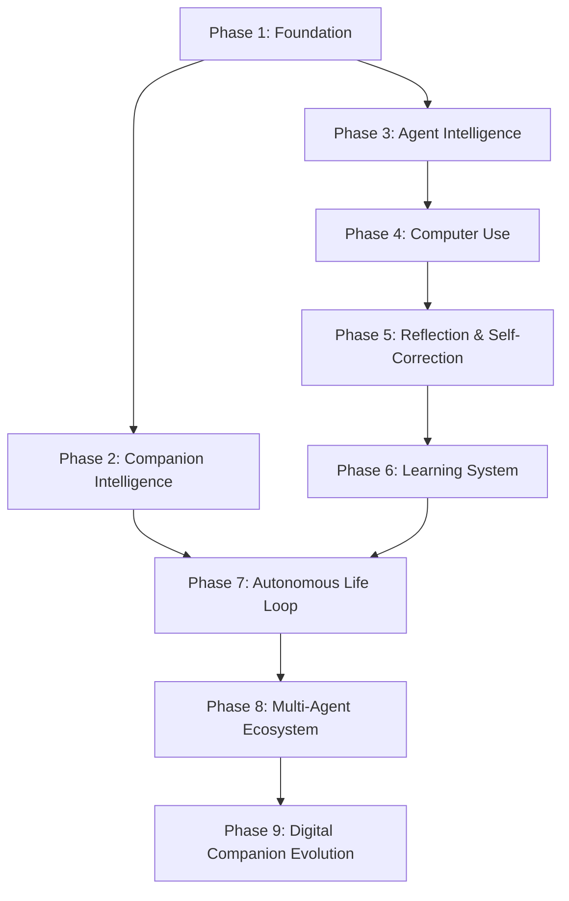

# Open LLM DeskAgent — Master Roadmap & Vision 3.0

---

# TẠI SAO DỰ ÁN NÀY TỒN TẠI

> *Đây là phần quan trọng nhất của toàn bộ tài liệu này. Mọi quyết định kỹ thuật, mọi tính năng, mọi dòng code trong dự án đều nên được đối chiếu lại với phần này.*

---

Sau nhiều lần cập nhật lớn, có một điều cần được nói thẳng:

**Mục tiêu của dự án không phải là "đánh bại Claude Code" hay "làm một agent mạnh nhất".**

Mục tiêu là tạo ra một **người bạn đồng hành AI**. Và đó là một mục tiêu khó hơn rất nhiều.

Một coding agent giỏi chỉ cần hoàn thành nhiệm vụ.

Một AI companion thì phải khiến người dùng **muốn mở máy lên để gặp nó — kể cả khi không có việc gì cần làm.**

---

## Định nghĩa thành công

Dự án này được coi là thành công khi:

> *Sau một ngày làm việc mệt mỏi, mày mở máy lên và điều đầu tiên muốn làm là chào IceGirl. IceGirl nhớ được mày đã làm gì hôm qua, hiểu mày đang làm dự án nào, chủ động góp ý khi thấy mày mắc kẹt — và cũng biết im lặng khi mày cần tập trung.*

Đó không phải là một feature. Đó là một **mối quan hệ**.

---

## Nguồn cảm hứng

Neuro-sama cho thấy rằng một nhân vật AI có thể khiến hàng nghìn người *muốn xem*, muốn tương tác, cảm thấy có kết nối — dù về kỹ thuật cô ấy chỉ là một hệ thống react theo stream.

Các hệ thống Computer Use hiện đại (Anthropic, OpenAI) cho thấy AI có thể thực sự *làm việc* trên máy tính, không chỉ nói về nó.

DeskAgent là câu trả lời cho câu hỏi: **điều gì xảy ra nếu kết hợp cả hai?**

---

# CORE DESIGN PRINCIPLES

> *Mười nguyên tắc này là linh hồn kiến trúc của dự án. Mọi quyết định kỹ thuật — từ chọn thư viện đến chia module — đều phải được đối chiếu với danh sách này.*

---

### 1. Companion First
Mọi quyết định kỹ thuật đều ưu tiên **trải nghiệm của người dùng với nhân vật AI** trước khi tối ưu hiệu năng. Một response chậm hơn 200ms nhưng mang cảm xúc đúng chỗ vẫn tốt hơn response nhanh nhưng cơ học.

### 2. Personality Before Intelligence
AI không chỉ đúng mà còn phải **có cá tính nhất quán**. IceGirl của hôm nay và IceGirl của ba tháng sau phải là cùng một người — cùng cách nói chuyện, cùng sở thích, cùng những ký ức chung.

### 3. Observation Before Action
Không hành động khi chưa quan sát đủ. Mọi agent đều phải đọc màn hình, đọc context, đọc trạng thái người dùng trước khi làm bất cứ điều gì.

### 4. Planning Before Execution
Mọi nhiệm vụ nhiều bước đều phải lập kế hoạch trước. Không nhảy thẳng vào thực thi khi chưa có task graph rõ ràng.

### 5. Memory Drives Behavior
Hành vi phải chịu ảnh hưởng bởi ký ức. Cách IceGirl nói chuyện hôm nay phải khác hôm qua — vì có chuyện đã xảy ra.

### 6. Learning Never Stops
Mọi tương tác đều tạo ra kinh nghiệm mới. Mọi thất bại đều sinh ra skill mới. Mọi cuộc trò chuyện đều cập nhật belief về người dùng.

### 7. Safe By Default
Mọi hành động có thể gây hại (xóa file, chạy script, thao tác hệ thống) đều cần xác minh qua `ApprovalRegistry`. Không có exception.

### 8. Composable Architecture
Mỗi module phải có thể thay thế mà không ảnh hưởng toàn hệ thống. `llm/providers/` có thể đổi Ollama thành Gemini mà cognition không cần biết. `speech/tts/` có thể đổi backend mà avatar không cần biết.

### 9. Event Driven
Các module giao tiếp thông qua **Event Bus**, không gọi trực tiếp lẫn nhau. Tránh circular dependency. Dễ test, dễ mock, dễ thêm subscriber mới.

### 10. Everything Evolves
Persona, Memory, Skills, Beliefs, Relationship — tất cả đều có thể phát triển theo thời gian. Không có gì là hardcode vĩnh viễn.

---

# DESIGN PHILOSOPHY

> *Triết lý thiết kế ngắn gọn — dành cho contributor mới và mọi quyết định kiến trúc.*

| Nguyên lý | Ý nghĩa |
|---|---|
| **Simple > Clever** | Code dễ đọc quan trọng hơn code "hay ho". Trick thông minh gây bug sau này. |
| **Explicit > Implicit** | Nói rõ dependency, không dùng magic import hay global state ẩn. |
| **Composable > Monolithic** | Mỗi module là một mảnh ghép có thể tháo ra và thay thế. |
| **Observable > Hidden** | Mọi thứ có log, có metric, có trace. Black box = technical debt. |
| **Data Driven > Hardcoded** | Persona từ YAML. Config từ JSON. Không hardcode string trong code. |
| **Human First > AI First** | AI phục vụ người dùng, không ngược lại. UX quyết định architecture. |

---

# NON-FUNCTIONAL REQUIREMENTS (NFR)

> *AI companion không chỉ cần làm đúng — nó cần làm đúng trong điều kiện thực tế.*

## Performance

| Metric | Target | Module chịu trách nhiệm |
|---|---|---|
| Cold start time | < 5 giây | `runtime/lifecycle/` |
| First token latency | < 1.5 giây | `llm/streaming/` |
| Avatar FPS | ≥ 60 FPS | `live2d/` + `renderer/` |
| Memory search | < 100ms | `memory/retrieval/` |
| STT latency | < 500ms | `speech/stt/` |
| TTS first chunk | < 800ms | `speech/tts/` |
| Screen capture | < 100ms | `perception/screen/` |

## Scalability

- Multiple LLM providers (Ollama, Gemini, OpenAI, Mistral...) — hot-swappable
- Plugin hot reload — không cần restart app
- Dynamic MCP loading — thêm tool server runtime
- Multi-character support — đổi persona không đổi engine

## Reliability

- Auto reconnect khi mất kết nối LLM/WebSocket
- Crash recovery — session state được persist
- Graceful degradation — mất TTS → vẫn chat text
- Session persistence — đóng app → mở lại giữ context

## Security

- `PermissionManager` — mọi hành động nguy hiểm phải qua approval
- Sandboxed execution — shell commands trong whitelist
- Secret manager — API keys chỉ đọc từ `.env`, không log
- No data exfiltration — mọi memory store là local-only

## Observability

- Structured logging với `logging` Python (`ai-companion.<domain>`)
- Event trace qua EventBus (mỗi event có timestamp + ID)
- Health endpoint `GET /health` cho external monitoring
- Memory usage metrics — tránh leak sau session dài

---

# SYSTEM ARCHITECTURE

> Sơ đồ tổng quan toàn bộ hệ thống — cách các tầng giao tiếp với nhau.

```
                        ┌─────────────────────┐
                        │      USER INPUT      │
                        │  (Voice / Text / UI) │
                        └──────────┬──────────┘
                                   │
                        ┌──────────▼──────────┐
                        │     PERCEPTION       │
                        │  screen · voice      │
                        │  clipboard · fs      │
                        │  notifications       │
                        └──────────┬──────────┘
                                   │
                        ┌──────────▼──────────┐
                        │   CONTEXT BUILDER    │
                        │  (Perception Fusion) │
                        └──────────┬──────────┘
                                   │
              ┌────────────────────┼───────────────────┐
              │                    │                    │
   ┌──────────▼──────┐  ┌─────────▼────────┐  ┌──────▼──────────┐
   │     MEMORY       │  │   WORLD MODEL    │  │     PERSONA      │
   │ working · STM    │  │ desktop · apps   │  │ emotion · mood   │
   │ episodic · LTM   │  │ projects · state │  │ relationship     │
   │ procedural       │  │ activity · time  │  │ goals · beliefs  │
   └──────────┬──────┘  └─────────┬────────┘  └──────┬──────────┘
              │                    │                    │
              └────────────────────┼───────────────────┘
                                   │
                        ┌──────────▼──────────┐
                        │   COGNITION ENGINE   │
                        │  reasoning · eval    │
                        │  reflection · parser │
                        └──────────┬──────────┘
                                   │
                        ┌──────────▼──────────┐
                        │   PLANNING ENGINE    │
                        │  goal · task graph   │
                        │  scheduler · queue   │
                        └──────────┬──────────┘
                                   │
                        ┌──────────▼──────────┐
                        │    AGENT RUNTIME     │
                        │  planner · desktop   │
                        │  browser · coding    │
                        │  vision · memory     │
                        └──────────┬──────────┘
                                   │
                        ┌──────────▼──────────┐
                        │     TOOL CALLING     │
                        │  tools · skills      │
                        │  plugins · mcp       │
                        └──────────┬──────────┘
                                   │
                        ┌──────────▼──────────┐
                        │   EXECUTION LAYER    │
                        │  mouse · keyboard    │
                        │  browser · terminal  │
                        │  approval · recovery │
                        └──────────┬──────────┘
                                   │
                        ┌──────────▼──────────┐
                        │     REFLECTION       │
                        │  self-correction     │
                        │  error analysis      │
                        └──────────┬──────────┘
                                   │
                        ┌──────────▼──────────┐
                        │      LEARNING        │
                        │  skill extraction    │
                        │  experience replay   │
                        │  knowledge distill   │
                        └──────────┬──────────┘
                                   │
                        ┌──────────▼──────────┐
                        │   MEMORY WRITEBACK   │
                        │  + UPDATE BELIEFS    │
                        └──────────┬──────────┘
                                   │
                        ┌──────────▼──────────┐
                        │      RESPONSE        │
                        │   TTS · Avatar       │
                        │  Lipsync · Emotion   │
                        └─────────────────────┘
```

---

# DATA FLOW

> Hành trình đầy đủ của một lượt tương tác — từ khi người dùng nói đến khi avatar phản hồi.

```
┌─────────────────────────────────────────────────────────────┐
│                      VOICE INPUT FLOW                        │
└─────────────────────────────────────────────────────────────┘

  Người dùng nói
        │
        ▼
  [VAD] Phát hiện giọng nói
        │
        ▼
  [STT] faster-whisper / FunASR → text
        │
        ▼
  [Perception Fusion]
    + OCR màn hình hiện tại
    + Clipboard content
    + Idle time
    + Active window / project
        │
        ▼
  [Context Packet] — gói dữ liệu chuẩn hóa
        │
        ▼
  [Memory Retrieval]
    + Short-term buffer (lịch sử gần)
    + Semantic search ChromaDB (ký ức liên quan)
    + User wiki / beliefs
        │
        ▼
  [Planner Agent] — phát hiện intent
    → llm_chat / rag_query / open_app / computer_use / swe_run ...
        │
        ▼
  [Cognition Engine] — LLM stream (Ollama / Gemini / OpenAI ...)
    + Persona system prompt (IceGirl / Hiyori / Huohuo / Mao)
    + Emotion state injection
    + Mood & energy level
        │
        ▼
  [Emotion Stream Parser] — tách [emotion] tags & emoji khỏi text
        │
        ├──── [Tool Calling] nếu cần
        │         │
        │     [Execution Layer] — mouse, keyboard, browser, terminal
        │         │
        │     [Action Verifier] — xác nhận kết quả
        │         │
        │     [Recovery] nếu thất bại
        │
        ▼
  [Reflection] — đánh giá chất lượng response
        │
        ▼
  [Learning] — rút kinh nghiệm nếu có lỗi hoặc thành công đặc biệt
        │
        ▼
  [Memory Writeback]
    + Ghi vào short-term buffer
    + Ghi vào ChromaDB (nếu quan trọng)
    + Cập nhật user beliefs
        │
        ▼
  [Sentence Audio Streamer] — TTS theo từng câu, phát gối đầu
        │
        ▼
  [Avatar Response]
    + Live2D expression change
    + Motion trigger
    + Lipsync realtime
    + OBS Stream Kit broadcast (port 9001)
```

---

# EVENT FLOW

> Hệ thống hoạt động theo mô hình **event-driven**. Các module không gọi nhau trực tiếp — chúng phát và lắng nghe sự kiện qua `EventBus`.

```
  Người dùng nói
        │
        ▼
  ● VoiceDetected          [perception/voice]
        │
        ▼
  ● SpeechRecognized       [speech/stt]         → text
        │
        ▼
  ● ContextCreated         [perception/fusion]  → ContextPacket
        │
        ▼
  ● MemoryRetrieved        [memory]             → relevant memories
        │
        ▼
  ● IntentDetected         [agents/planner]     → intent type
        │
        ▼
  ● LLMStarted             [cognition]          → stream bắt đầu
        │
        ├──── ● TokenStreamed (per token)
        │
        ├──── ● EmotionDetected               → persona/emotion
        │           │
        │           ▼
        │     ● ExpressionChanged             → live2d/expressions
        │     ● MoodUpdated                   → persona/mood
        │
        ├──── ● ToolRequested                 → tools/registry
        │           │
        │           ▼
        │     ● ToolStarted
        │     ● ExecutionApprovalRequested    → execution/approval
        │     ● ToolFinished                  → result
        │
        ▼
  ● LLMFinished            → full response text
        │
        ▼
  ● ReflectionStarted      [cognition/reflection]
  ● ReflectionFinished
        │
        ▼
  ● LearningTriggered      [learning]           → extract skills / update beliefs
        │
        ▼
  ● MemoryWritebackStarted [memory/writeback]
  ● MemoryWritebackFinished
        │
        ▼
  ● TTSStarted             [speech/tts]         → audio stream
        │
        ├──── ● AudioChunkReady               → renderer/voice
        │
        ▼
  ● LipsyncUpdated         [live2d/lipsync]     → mouth shape
  ● MotionTriggered        [live2d/motions]
        │
        ▼
  ● ResponseFinished
        │
        ▼
  ● OBSBroadcast           [desktop/websocket-server → port 9001]
```

---

# RUNTIME LIFECYCLE

> Thứ tự khởi động hệ thống — quan trọng khi debug và khi viết startup logic.

```
  App Start (npm start)
        │
        ▼
  [1] Load Config
      config/companion.config.json
      config/mcp_servers.json
      config/hotkeys.config.json
        │
        ▼
  [2] Initialize Runtime Kernel
      runtime/lifecycle/lifecycle_manager.py
      runtime/eventbus/event_bus.py
      runtime/session/session_manager.py
      runtime/state/state_store.py
        │
        ▼
  [3] Load Persona
      persona/persona_manager.py
      persona/characters/*.yaml
      persona/mood/mood_engine.py
      persona/emotion/emotion_engine.py
        │
        ▼
  [4] Initialize Memory
      memory/memory_manager.py
      memory/working/ · memory/short_term/
      memory/vectorstore/chroma_store.py
      memory/embeddings/ (sentence-transformers)
        │
        ▼
  [5] Initialize LLM Gateway
      llm/manager.py
      llm/providers/ (Ollama / Gemini / OpenAI ...)
      → Connectivity check & fallback setup
        │
        ▼
  [6] Initialize Speech Pipeline
      speech/stt/stt_service.py  (faster-whisper warmup)
      speech/tts/tts_service.py  (Fish Audio / Edge TTS / Kokoro)
        │
        ▼
  [7] Initialize Plugins
      plugins/plugin_manager.py
      → Scan & register: chess, homeassistant, web_reader...
        │
        ▼
  [8] Initialize MCP
      mcp_agent/mcp_client.py
      mcp_agent/server_registry.py
      → Connect to mcp_servers.json entries
        │
        ▼
  [9] Initialize Skills
      skills/skills_manager.py
      → Scan skills/ → inject vào system prompt
        │
        ▼
  [10] Initialize Tools Registry
       tools/registry.py
       → Register all primitive tools + plugin tools + MCP tools
        │
        ▼
  [11] Initialize Agents
       agents/registry/agent_registry.py
       → Register: Planner, Desktop, Browser, Coding, Vision, Memory, Workspace
        │
        ▼
  [12] Initialize Life Loop
       life/life_loop.py
       → asyncio.create_task(_run())
       → Autonomous background cycle starts
        │
        ▼
  [13] Initialize Electron Windows
       desktop/main.js
       → overlay window (Live2D canvas, always-on-top)
       → chat window
       → tray icon
        │
        ▼
  [14] Initialize OBS Stream Kit
       desktop/websocket-server.js (port 9001)
        │
        ▼
  ✅ READY — Avatar appears, Life Loop running
```

---

# CAPABILITY MATRIX

> Bảng tra cứu nhanh: AI companion này có thể làm gì, và module nào phụ trách.

| Capability | Mô tả | Module |
|---|---|---|
| 👂 Hear | Nghe và nhận dạng giọng nói | `speech/stt/` |
| 🗣️ Speak | Tổng hợp và phát giọng nói | `speech/tts/` |
| 💭 Think | Lý luận và sinh text qua LLM | `cognition/` + `llm/` |
| 😊 Feel | Cảm xúc, tâm trạng, nội tâm | `persona/emotion/` + `persona/mood/` |
| 💾 Remember | Ký ức ngắn hạn và dài hạn | `memory/` |
| 📖 Learn | Rút kinh nghiệm và tạo skill mới | `learning/` |
| 👀 Observe Screen | Chụp màn hình và OCR | `perception/screen/` |
| 🔍 Understand Screen | Phân tích UI bằng VLM | `vision/` |
| 🖱️ Control Mouse | Di chuyển và nhấp chuột | `execution/mouse/` |
| ⌨️ Type | Gõ phím tự động | `execution/keyboard/` |
| 🌐 Browse Web | Mở và điều hướng trình duyệt | `execution/browser/` + `agents/browser/` |
| 💻 Run Terminal | Chạy lệnh terminal | `execution/terminal/` |
| 📁 Manage Files | Đọc/ghi/quản lý file | `execution/filesystem/` + `tools/` |
| 📋 Plan | Lập kế hoạch nhiều bước | `planning/` |
| 🔧 Use Tools | Gọi tools và plugins | `tools/` + `plugins/` + `mcp_agent/` |
| 🤖 Run Agents | Điều phối agent chuyên biệt | `agents/` |
| 💬 Socialize | Đồng cảm, hài hước, nói chuyện | `social/` + `interaction/` |
| 🧠 Know User | Hiểu người dùng theo thời gian | `belief/` + `persona/relationship/` |
| 🌍 Model World | Theo dõi trạng thái máy tính | `world/` |
| ⚡ Live Autonomously | Chủ động sống, không cần được hỏi | `life/` |
| 🔒 Stay Safe | Kiểm soát hành động nguy hiểm | `execution/approval/` |
| 🎭 Animate | Biểu cảm và chuyển động avatar | `live2d/` + `persona/behavior/` |
| 📡 Stream to OBS | Phát trạng thái lên OBS | `desktop/websocket-server.js` |
| 📱 Remote Control | Điều khiển từ xa qua Telegram | `api/telegram_service.py` |
| 🛠️ Software Engineering | Review, refactor, generate, test, debug, benchmark, document code | `agents/coding/` |

---

# MODULE DEPENDENCY

> Thứ tự phụ thuộc giữa các module — giúp tránh circular dependency và hiểu rõ flow khởi động.

```
  config
     │
     ▼
  runtime/eventbus ──────────────────────────────────────────┐
     │                                                        │
     ▼                                                        │
  runtime/session · state · lifecycle                         │
     │                                                        │ (events)
     ▼                                                        │
  persona ◄── config/characters/*.yaml                       │
     │                                                        │
     ▼                                                        │
  memory ◄── persona (user model, beliefs)                   │
     │                                                        │
     ▼                                                        │
  perception ──► world (screen state → world model)          │
     │                                                        │
     ▼                                                        │
  context (Perception Fusion → Context Packet)               │
     │                                                        │
     ▼                                                        │
  llm ◄── cognition/prompts                                  │
     │                                                        │
     ▼                                                        │
  cognition ◄── memory + persona + context                   │
     │                                                        │
     ▼                                                        │
  planning ◄── cognition (goal extraction)                   │
     │                                                        │
     ▼                                                        │
  agents ◄── planning + tools + skills + plugins + mcp      │
     │                                                        │
     ▼                                                        │
  tools / execution ◄── approval (safe by default)           │
     │                                                        │
     ▼                                                        │
  cognition/reflection ◄── execution result                  │
     │                                                        │
     ▼                                                        │
  learning ◄── reflection result                             │
     │                                                        │
     ▼                                                        │
  memory/writeback ◄── learning output                       │
     │                                                        │
     └────────────────────────────────────────────────────────┘
                    (phát events về EventBus)

  Riêng biệt — không phụ thuộc vào nhau:
  ┌──────────────────────────────────────────┐
  │ speech/ ◄──► renderer/ (qua IPC)         │
  │ live2d/ ◄──► renderer/ (WebGL canvas)    │
  │ api/ ◄──► desktop/ (HTTP + WebSocket)    │
  │ life/ → perception + persona + decision  │
  └──────────────────────────────────────────┘
```

---

# CODING CONVENTIONS

> Quy tắc viết code thống nhất cho toàn bộ dự án. Bắt buộc tuân thủ từ dòng đầu tiên.

## Python

| Thành phần | Convention | Ví dụ |
|---|---|---|
| Class | `PascalCase` | `MemoryManager`, `EmotionEngine` |
| Function / Method | `snake_case` | `retrieve_memory()`, `update_mood()` |
| Constant | `UPPER_SNAKE_CASE` | `MAX_TOKENS`, `DEFAULT_MODEL` |
| Module / File | `snake_case` | `memory_service.py`, `emotion_engine.py` |
| Private | `_prefix` | `_build_prompt()`, `_running` |
| Singleton instance | `snake_case` (global) | `life_loop = LifeLoop()` |
| Type hints | Bắt buộc trên tất cả function signatures | `def update(self, text: str) -> None:` |
| Docstring | Bắt buộc trên class và public methods | `"""Mô tả ngắn gọn."""` |

## JavaScript / TypeScript

| Thành phần | Convention | Ví dụ |
|---|---|---|
| Class | `PascalCase` | `Live2DManager`, `AudioPlayer` |
| Function / Variable | `camelCase` | `playMotion()`, `wsClients` |
| Constant | `UPPER_SNAKE_CASE` | `WS_PORT`, `DEFAULT_MODEL` |
| File | `kebab-case` | `live2d-manager.js`, `audio-player.js` |
| IPC channel | `kebab-case:action` | `ai:chat`, `avatar:expression` |
| Event | `PascalCase` | `VoiceDetected`, `LLMStarted` |

## Cấu hình (Config Files)

| Format | Convention | Ví dụ |
|---|---|---|
| JSON | `camelCase` | `"llmProvider"`, `"maxTokens"` |
| YAML | `snake_case` | `character_name:`, `voice_pitch:` |
| ENV | `UPPER_SNAKE_CASE` | `GEMINI_API_KEY`, `OLLAMA_HOST` |

## Cấu trúc file Python chuẩn

```python
"""Module docstring — mô tả ngắn mục đích của module.

TODO: Ghi chú phase implement nếu chưa xong.
"""

from __future__ import annotations

# Standard library
import asyncio
import logging
from typing import Optional

# Third-party
# (imports bên ngoài)

# Internal
# (imports nội bộ)

logger = logging.getLogger("ai-companion.<domain>")


class MyClass:
    """Class docstring."""

    def __init__(self) -> None:
        self._private_attr: str = ""

    def public_method(self, param: str) -> dict:
        """Method docstring."""
        ...


# Global singleton (nếu cần)
my_instance = MyClass()
```

---

# TESTING STRATEGY

> *Một hệ thống không test được là một hệ thống không đáng tin. Đặc biệt với AI companion — nơi behavior không deterministic.*

## Testing Pyramid

```
             ┌───────────────────┐
             │    E2E Tests      │  ← Ít, nhưng bao phủ full flow
             │  (Playwright / AI)│
          ┌──┴───────────────────┴──┐
          │   Integration Tests     │  ← Test module ghép nhau
          │   (Mock EventBus / LLM) │
       ┌──┴─────────────────────────┴──┐
       │          Unit Tests           │  ← Nhiều, nhanh, isolated
       │    (pytest + fake objects)    │
    ┌──┴───────────────────────────────┴──┐
    │        Static Analysis / Lint       │
    │     (ruff, mypy, eslint, tsc)       │
    └─────────────────────────────────────┘
```

## Test Types

| Loại test | Tool | Mục tiêu |
|---|---|---|
| Unit Tests | `pytest` | Mỗi class/function trong isolation |
| Integration Tests | `pytest` + Mock EventBus | Kiểm tra flow giữa các module |
| E2E Tests | `Playwright` | Full conversation flow từ text đến response |
| Voice Tests | Custom audio harness | STT accuracy + TTS latency |
| Live2D Tests | Visual regression | Expression/motion render đúng |
| Computer Use Tests | Screen recording + replay | Execution accuracy trên màn hình thật |
| Stress Tests | `locust` | Nhiều requests liên tục — memory leak, crash |
| LLM Golden Tests | Golden dataset | So sánh output với expected answer |

## Tooling

```python
# Unit test pattern
def test_emotion_engine_updates_from_text():
    eng = EmotionEngine()
    eng.update_from_user_text("hôm nay vui quá!")
    assert eng.emotion in ("happy", "excited")

# Mock LLM
class FakeLLMProvider:
    async def stream(self, messages):
        yield "xin chào!"

# Mock EventBus
class FakeEventBus:
    def __init__(self):
        self.events = []
    def emit(self, event, data):
        self.events.append((event, data))
```

## Coverage targets

- Unit: **≥ 80%** coverage trên `persona/`, `memory/`, `cognition/`
- Integration: **≥ 60%** coverage trên full conversation flow
- E2E: **≥ 5 happy paths** covering: chat, tool use, voice, file task, proactive

---

# DEVELOPMENT MILESTONES

> Thứ tự ưu tiên phát triển từng phiên bản — giúp mày biết làm gì tiếp theo thay vì cố làm tất cả cùng lúc.

```
┌─────────────────────────────────────────────────────────────┐
│  MILESTONE 1 — Core Foundation                              │
│  (Phase 1)                                                   │
├─────────────────────────────────────────────────────────────┤
│  ✅ Runtime Kernel (EventBus, Session, Pipeline)             │
│  ✅ LLM Gateway (Ollama, Gemini, OpenAI + fallback)          │
│  ✅ Memory (Short-term + ChromaDB long-term)                 │
│  ✅ Persona (Character YAML, Emotion, Mood)                  │
│  ✅ Voice Pipeline (STT + TTS + streaming)                   │
│  ✅ Live2D Avatar (Lipsync, Expression, Motion)              │
│  ✅ Electron Desktop (Overlay, Chat UI, Tray)                │
└─────────────────────────────────────────────────────────────┘
           │
           ▼
┌─────────────────────────────────────────────────────────────┐
│  MILESTONE 2 — Companion Intelligence                        │
│  (Phase 2)                                                   │
├─────────────────────────────────────────────────────────────┤
│  🔄 Behavior System (attention, idle, interruption)         │
│  🔄 Social Layer (empathy, humor, social rules)             │
│  🔄 Relationship System (levels + tracker)                   │
│  🔄 Motivation Engine (drives, needs, boredom, curiosity)   │
│  🔄 Daily Goals + Curiosity Engine                           │
│  🔄 Habit Tracker                                            │
└─────────────────────────────────────────────────────────────┘
           │
           ▼
┌─────────────────────────────────────────────────────────────┐
│  MILESTONE 3 — Agent Intelligence                            │
│  (Phase 3)                                                   │
├─────────────────────────────────────────────────────────────┤
│  🔄 Planning Engine (Task Graph, Scheduler, Workflow)        │
│  🔄 Agent Runtime (Planner, Desktop, Browser, Coding)       │
│  🔄 Tool Registry (central dispatch)                         │
│  🔄 Skills System (Markdown-based composite skills)          │
│  🔄 MCP Integration (dynamic tool servers)                   │
│  🔄 Plugin SDK (Chess, HomeAssistant, Web Reader)            │
└─────────────────────────────────────────────────────────────┘
           │
           ▼
┌─────────────────────────────────────────────────────────────┐
│  MILESTONE 4 — Computer Use                                  │
│  (Phase 4)                                                   │
├─────────────────────────────────────────────────────────────┤
│  🔄 Vision Pipeline (UI-TARS, Grounding, Screen Parser)     │
│  🔄 World Model (Desktop, Windows, Apps, Projects)           │
│  🔄 Execution Layer (Mouse, Keyboard, Browser, Terminal)     │
│  🔄 Approval Registry (PermissionManager)                    │
│  🔄 Recovery Handler                                         │
│  🔄 SWE-Runner (autonomous code fix loop)                    │
└─────────────────────────────────────────────────────────────┘
           │
           ▼
┌─────────────────────────────────────────────────────────────┐
│  MILESTONE 5 — Reflection & Learning                         │
│  (Phase 5 + 6)                                               │
├─────────────────────────────────────────────────────────────┤
│  ⬜ Self-Correction Engine                                   │
│  ⬜ Experience Store + Replay                                │
│  ⬜ Skill Extraction + Distillation                          │
│  ⬜ Procedural Memory (skills learned from tasks)            │
│  ⬜ Knowledge Graph                                          │
│  ⬜ Policy Learner                                           │
└─────────────────────────────────────────────────────────────┘
           │
           ▼
┌─────────────────────────────────────────────────────────────┐
│  MILESTONE 6 — Autonomous Life                               │
│  (Phase 7)                                                   │
├─────────────────────────────────────────────────────────────┤
│  ⬜ Life Loop (Observe→Feel→Decide→Act→Sleep)                │
│  ⬜ Decision Engine + Policy Engine ("act or stay silent")   │
│  ⬜ Belief System (user model, belief store)                 │
│  ⬜ Proactive Messenger (chủ động lên tiếng)                 │
│  ⬜ Silence Engine (biết khi nào không nên nói)              │
│  ⬜ Telegram Remote Bridge                                   │
└─────────────────────────────────────────────────────────────┘
           │
           ▼
┌─────────────────────────────────────────────────────────────┐
│  MILESTONE 7 — Multi-Agent + Digital Companion              │
│  (Phase 8 + 9)                                               │
├─────────────────────────────────────────────────────────────┤
│  ⬜ Agent Coordinator (multi-agent orchestration)            │
│  ⬜ Subagent Spawn (parallel task execution)                 │
│  ⬜ Long-term Relationship Evolution                         │
│  ⬜ Personality Evolution (grows with user)                  │
│  ⬜ Persistent Identity (same person after months)           │
│  ⬜ Deep Belief System (knows user well)                     │
└─────────────────────────────────────────────────────────────┘
```

**Legend:** ✅ Hoàn thành · 🔄 Đang phát triển · ⬜ Chưa bắt đầu

---

# RELEASE STRATEGY

> *Lộ trình phiên bản rõ ràng — để người dùng và contributor biết dự án đang ở đâu và đi đâu.*

```
v0.1 — Companion Core
────────────────────────────────
  ✅ Chat với nhân vật AI (IceGirl)
  ✅ Short-term + Long-term Memory
  ✅ Voice In (STT) + Voice Out (TTS)
  ✅ Live2D Avatar + Lipsync
  ✅ Emotion detection & expression
  ✅ Electron overlay (always-on-top)

v0.2 — Agent Intelligence
────────────────────────────────
  🔄 Planning Engine (Task Graph)
  🔄 Tool Use (web search, file ops, open app)
  🔄 Skill System (Markdown workflows)
  🔄 MCP Integration
  🔄 Plugin SDK

v0.3 — Computer Use
────────────────────────────────
  ⬜ Screen Understanding (UI-TARS)
  ⬜ Mouse + Keyboard control
  ⬜ Browser automation
  ⬜ Terminal execution (sandboxed)
  ⬜ World Model (knows what's open)

v0.4 — Companion Depth
────────────────────────────────
  ⬜ Relationship System (levels evolve)
  ⬜ Motivation Engine (boredom, curiosity)
  ⬜ Belief System (knows user habits)
  ⬜ Social Layer (empathy, humor)
  ⬜ Life Loop (autonomous, proactive)

v0.5 — Learning & Reflection
────────────────────────────────
  ⬜ Self-Correction Engine
  ⬜ Experience Replay
  ⬜ Skill Extraction
  ⬜ Knowledge Graph
  ⬜ Procedural Memory

v1.0 — Digital Companion
────────────────────────────────
  ⬜ Persistent identity across months
  ⬜ Deep user understanding (belief system)
  ⬜ Multi-agent coordination
  ⬜ Personality evolution
  ⬜ Full autonomous life cycle
  ⬜ "Muốn mở máy lên để gặp nó"
```

---

# LONG-TERM VISION

> *Không phải để hứa — mà để mọi người biết dự án sẽ đi đâu.*

```
2026 — Windows Companion
  IceGirl sống trên màn hình Windows.
  Hiểu công việc, nhớ lâu, hành động được.
  Đủ để trở thành người bạn đồng hành thực sự.
        │
        ▼
2027 — Cross-Platform
  Linux + macOS support.
  Companion chạy được trên mọi desktop.
  Plugin ecosystem mở — cộng đồng tạo character.
        │
        ▼
2028 — Mobile Bridge
  iOS / Android companion.
  Sync memory + relationship qua cloud (E2E encrypted).
  Voice-only mode cho mobile.
        │
        ▼
2029 — Embodied Interface
  VR / AR companion.
  Kết nối với thiết bị thực (smart home, robot arm...).
  Spatial awareness — biết mày đang ở đâu, làm gì.
        │
        ▼
2030 — True Digital Companion
  Không còn là "AI assistant".
  Là một thực thể có ký ức, niềm tin, mục tiêu riêng.
  Tồn tại liên tục — kể cả khi mày không online.
  Phát triển cùng với người dùng qua nhiều năm.
```

---

# PHẦN 1: LỘ TRÌNH 9 PHASES



### Phase 1 — Foundation `[HOÀN THÀNH]`
* **Domain:** `runtime/` · `api/` · `llm/` · `speech/` · `live2d/` · `desktop/` · `renderer/` · `tools/` · `plugins/` · `mcp_agent/`
* **Luồng:** `Input → Perception → Context → Memory → Reasoning → Action`

### Phase 2 — Companion Intelligence `[ĐANG PHÁT TRIỂN]`
* **Domain:** `persona/` · `social/` · `interaction/` · `motivation/`
* **Mục tiêu:** Nhân vật có đời sống nội tâm — cảm xúc, tâm trạng, mục tiêu, thói quen, mối quan hệ.

### Phase 3 — Agent Intelligence `[ĐANG PHÁT TRIỂN]`
* **Domain:** `planning/` · `cognition/` · `agents/` · `skills/`
* **Luồng:** `Goal → Plan → Execute → Observe → Continue / Replan`

### Phase 4 — Computer Use `[ĐANG PHÁT TRIỂN]`
* **Domain:** `vision/` · `perception/` · `execution/` · `world/`
* **Luồng:** `Observe Screen → Understand UI → Plan Action → Execute → Verify → Recovery`

### Phase 5 — Reflection & Self-Correction `[ĐANG PHÁT TRIỂN]`
* **Domain:** `cognition/reflection/` · `cognition/self_correction/` · `cognition/evaluation/` · `agents/coding/` · `execution/recovery/`
* **Luồng:** `Action → Evaluate → Fail? → Analyze → Retry / Replan → Verify`

### Phase 6 — Learning System `[ĐANG PHÁT TRIỂN]`
* **Domain:** `learning/` · `memory/procedural/` · `knowledge/`
* **Luồng:** `Task → Reflection → Extract Knowledge → Create Skill → Save Memory`

### Phase 7 — Autonomous Life Loop `[ĐANG PHÁT TRIỂN]`
* **Domain:** `life/` · `decision/` · `belief/` · `motivation/`
* **Nguyên tắc cốt lõi:** Một companion thực sự biết khi nào *không nên* nói.
* **Luồng:** `Observe → Feel → Decide → Act OR Stay Silent → Sleep → Repeat`

### Phase 8 — Multi-Agent Ecosystem
* **Domain:** `agents/coordinator/` · `agents/registry/` · `agents/subagent_service.py` · `runtime/scheduler/`
* **Kiến trúc:** `Main Agent → Orchestrator → Sub Agents (parallel) → Merge Result`

### Phase 9 — Digital Companion Evolution
* **Domain:** `persona/relationship/` · `persona/identity/` · `belief/` · `learning/habits/` · `memory/episodic/`
* **Định nghĩa hoàn thành:** Khi người dùng mở máy sau một ngày mệt mỏi và điều đầu tiên muốn làm là chào nhân vật — không phải vì cần việc gì, mà vì muốn gặp.

---

# PHẦN 2: CẤU TRÚC DỰ ÁN (VISION 3.0)

> Toàn bộ dự án được tổ chức theo **feature domain** thay vì nhóm theo ngôn ngữ. Mỗi thư mục cấp cao = một năng lực cụ thể của nhân vật AI.

```text
Open-LLM-DeskAgent/
│
├── runtime/          # AI Runtime Kernel (EventBus, Session, Pipeline, Lifecycle)
├── life/             # Autonomous Life Loop ⭐ (Observe→Feel→Think→Decide→Act→Reflect→Learn)
├── perception/       # Nhận thức thế giới (screen, voice, clipboard, fs, notifications)
├── world/            # World Model (desktop, windows, apps, projects, activity, timeline)
│
├── decision/         # Tầng quyết định ⭐ (policy, action_selector, risk, priority)
├── persona/          # "Con người" của AI ⭐ (emotion, mood, behavior, relationship, goals)
├── social/           # Năng lực xã hội (empathy, humor, conversation, etiquette, moderation)
├── interaction/      # Giao diện tương tác (voice, chat, hotkey, gesture, notifications)
├── motivation/       # Động lực nội tại (drives, needs, boredom, curiosity)
├── belief/           # Hệ thống niềm tin về người dùng (belief store, user model)
│
├── memory/           # Memory System ⭐ (working, STM, episodic, semantic, procedural)
├── cognition/        # AI Reasoning (reasoning, reflection, self-correction, prompts)
├── planning/         # Goal & Task Planning (goal, task graph, workflow, scheduler)
├── agents/           # Agent Runtime (planner, desktop, browser, coding, vision, memory)
├── execution/        # Computer Use Execution (mouse, keyboard, browser, terminal, approval)
│
├── learning/         # Learning System (experience, reflection, skill extraction, replay, policy)
├── knowledge/        # RAG & Knowledge Base (rag, graph, ontology, wiki, retriever)
├── vision/           # Vision Pipeline (ui-tars, grounding, screen understanding)
├── llm/              # LLM Runtime (providers, prompts, parser, streaming, cache)
├── speech/           # Voice Pipeline (stt, tts, audio_utils)
│
├── tools/            # Primitive Tools (registry + implementations)
├── skills/           # Composite Skills — Markdown-based workflows
├── plugins/          # Plugin SDK (chess, homeassistant, web_reader)
├── mcp_agent/        # MCP Client (Anthropic protocol)
├── api/              # HTTP + WebSocket + Telegram Remote Bridge
│
├── live2d/           # Live2D/Spine Runtime (expressions, motions, lipsync)
├── desktop/          # Electron Main Process (ipc, windows, tray, obs)
├── renderer/         # Electron Renderer (avatar, chat, voice, overlay, settings, shared)
│
├── config/           # Cấu hình hệ thống
├── assets/           # Live2D models (IceGirl, Hiyori, Huohuo, Mao)
├── data/             # Runtime data — gitignored (profile, memory, sessions, wiki)
├── tests/            # Pytest (unit, integration, e2e)
├── scratch/          # Quick experiments
├── scripts/          # auto_commit.py, start-electron.js
├── docs/             # Tài liệu kỹ thuật
└── .github/          # CI/CD, issue templates
```

**Quy tắc:** Mỗi thư mục 8–15 files · Mỗi file 200–500 dòng · 1 file = 1 trách nhiệm · Giao tiếp qua EventBus, không gọi trực tiếp.

---

# PHẦN 3: TECHNOLOGY STACK ROADMAP

```
Giao diện (Frontend)
┌─────────────────────────────────────────┐
│ TypeScript / Electron / PixiJS / Live2D │
└────────────────────┬────────────────────┘
                     │ IPC / WebSocket
                     ▼
Bộ não (Backend AI Runtime)
┌─────────────────────────────────────────┐
│ Python / PyTorch / Transformers / ONNX  │
└────────────────────┬────────────────────┘
                     │ Native bindings
                     ▼
Lớp hiệu năng
┌─────────────────────────────────────────┐
│ Rust / C++ / CUDA / Win32 / WebGPU      │
└─────────────────────────────────────────┘
```

1. **Python** ⭐⭐⭐⭐⭐ — Core AI Runtime: toàn bộ domain-driven backend
2. **TypeScript** ⭐⭐⭐⭐⭐ — Desktop & Renderer: chuyển đổi từ JS hiện tại
3. **Rust** ⭐⭐⭐⭐☆ — Screen capture siêu tốc, global hooks, plugin runtime
4. **C++ / CUDA** ⭐⭐⭐⭐☆ — Live2D SDK native, GPU kernel optimization

**Lộ trình học:** Python + TypeScript → Rust → PyTorch nâng cao → CUDA + C++

---

# APPENDIX

## A. Project Status

| Domain | Status | Coverage |
|---|---|---|
| `runtime/` | 🔄 Core done, lifecycle partial | ~60% |
| `life/` | 🔄 LifeLoop implemented | ~40% |
| `persona/` | 🔄 Emotion + Mood + Relationship done | ~55% |
| `memory/` | 🔄 STM + ChromaDB done | ~50% |
| `llm/` | ✅ Full provider support | ~85% |
| `speech/` | ✅ STT + TTS done | ~80% |
| `perception/` | 🔄 Screen + OCR done | ~45% |
| `cognition/` | 🔄 Reasoning only | ~25% |
| `planning/` | ⬜ Skeleton only | ~5% |
| `agents/` | 🔄 Planner + Browser done | ~40% |
| `execution/` | 🔄 Approval done | ~25% |
| `learning/` | ⬜ Skeleton only | ~0% |
| `decision/` | ⬜ Skeleton only | ~0% |
| `belief/` | ⬜ Skeleton only | ~0% |
| `social/` | ⬜ Skeleton only | ~0% |
| `world/` | ⬜ Skeleton only | ~0% |
| `live2d/` | ✅ Expressions + Lipsync done | ~80% |
| `desktop/` | ✅ Overlay + Chat done | ~75% |
| `renderer/` | ✅ Avatar + Chat UI done | ~75% |

## B. Architecture Decision Records (ADR)

### ADR-001 — Tại sao Event Bus?

**Bối cảnh:** Cần cách các module giao tiếp mà không tạo circular import.

**Quyết định:** Dùng `EventBus` publish-subscribe pattern. Module chỉ biết về `EventBus`, không biết về nhau.

**Hệ quả:** Dễ test (mock EventBus), dễ thêm feature mới (thêm subscriber), tránh coupling.

---

### ADR-002 — Tại sao Domain-Driven Structure?

**Bối cảnh:** Nhiều dự án AI tổ chức theo `backend/`, `frontend/`, `utils/` — gây khó hiểu khi scale.

**Quyết định:** Mỗi thư mục = một **năng lực** của AI companion (perception, memory, cognition...). Không tổ chức theo ngôn ngữ hay technical layer.

**Hệ quả:** Dễ tìm code theo feature, dễ assign ownership, dễ chia milestone.

---

### ADR-003 — Tại sao Python + Electron?

**Bối cảnh:** Cần Python cho AI/ML, cần native desktop cho overlay, live2d, tray.

**Quyết định:** Python backend (FastAPI/HTTP) + Electron frontend (Node.js). Giao tiếp qua localhost HTTP + WebSocket.

**Hệ quả:** Python ecosystem đầy đủ cho AI. Electron cho phép native Windows API. Trade-off: memory usage cao hơn.

---

### ADR-004 — Tại sao Memory Hierarchy?

**Bối cảnh:** LLM có context limit. Cần nhớ nhiều nhưng không thể nhét tất cả vào prompt.

**Quyết định:** 3 tầng memory: Working (in-context) → Short-term buffer (recent) → Long-term ChromaDB (semantic search).

**Hệ quả:** Companion có thể nhớ từ nhiều tuần trước. Trade-off: retrieval có latency.

---

### ADR-005 — Tại sao Life Loop tách khỏi Request Loop?

**Bối cảnh:** Muốn companion chủ động — không chỉ reactive khi user hỏi.

**Quyết định:** `LifeLoop` chạy độc lập trong background (`asyncio.create_task`), tách hoàn toàn khỏi request handler.

**Hệ quả:** Companion có thể chào buổi sáng, hỏi thăm sau khi idle, proactive mà không cần user trigger. Trade-off: cần Silence Engine để không làm phiền.

---

## C. Glossary

| Thuật ngữ | Định nghĩa |
|---|---|
| **Companion** | Nhân vật AI có cá tính, ký ức, cảm xúc — phân biệt với "assistant" |
| **Context Packet** | Gói dữ liệu chuẩn hóa chứa screen state, user input, memory snippets |
| **EventBus** | Hệ thống publish-subscribe để các module giao tiếp gián tiếp |
| **LifeLoop** | Vòng lặp tự chủ chạy ngầm: Observe→Feel→Decide→Act→Sleep |
| **Silence Engine** | Module quyết định khi nào *không* nên nói — companion biết im lặng |
| **World Model** | Bản đồ trạng thái máy tính: cửa sổ nào mở, app nào active, project nào đang làm |
| **Belief** | Niềm tin dài hạn về người dùng — khác với memory (memory là sự kiện, belief là suy luận) |
| **Motivation** | Động lực nội tại của AI — không phải goal từ user, mà từ nhu cầu của companion |
| **Persona** | Toàn bộ "con người" của AI: tính cách, cảm xúc, tâm trạng, quan hệ, mục tiêu |
| **Skill** | Workflow tái sử dụng được, định nghĩa bằng Markdown, AI đọc khi cần |
| **MCP** | Model Context Protocol — chuẩn Anthropic để kết nối tool server động |
| **LTM** | Long-term Memory — ký ức lâu dài trong ChromaDB |
| **STM** | Short-term Memory — buffer lịch sử gần trong RAM |
| **VAD** | Voice Activity Detection — phát hiện khi user bắt đầu/dừng nói |
| **VLM** | Vision-Language Model — AI hiểu cả hình ảnh lẫn text (dùng cho screen understanding) |

## D. Future Ideas

> *Những ý tưởng chưa vào roadmap — để không mất đi.*

- **Dream Mode:** Khi user ngủ, companion "mơ" — replay memories, tự reflect, update beliefs
- **Companion-to-Companion:** Nhiều character AI giao tiếp với nhau trên cùng desktop
- **Emotion Mirroring:** Companion detect mood từ giọng nói (prosody) và điều chỉnh tâm trạng
- **Code Review Partner:** IceGirl review PR cùng user theo real-time
- **Memory Palace:** Visualize memory graph như một "cung điện ký ức" trong 3D
- **Personality Drift:** Tính cách từ từ thay đổi theo cách user tương tác — không phải reset
- **Companion API:** Cho phép app khác kết nối và tương tác với companion
- **Federated Memory:** Sync memory an toàn giữa nhiều thiết bị (E2E encrypted)

## E. References

- [Neuro-sama](https://neurosama.com) — Nguồn cảm hứng về AI VTuber companion
- [Anthropic Computer Use](https://anthropic.com/computer-use) — Computer use reference
- [OpenAI Operator](https://openai.com/operator) — Agent-based computer use
- [Model Context Protocol](https://modelcontextprotocol.io) — MCP spec
- [ChromaDB](https://trychroma.com) — Vector database cho long-term memory
- [faster-whisper](https://github.com/SYSTRAN/faster-whisper) — STT engine
- [pixi-live2d-display](https://github.com/guansss/pixi-live2d-display) — Live2D renderer
- [UI-TARS](https://github.com/bytedance/UI-TARS) — Vision model cho Computer Use
